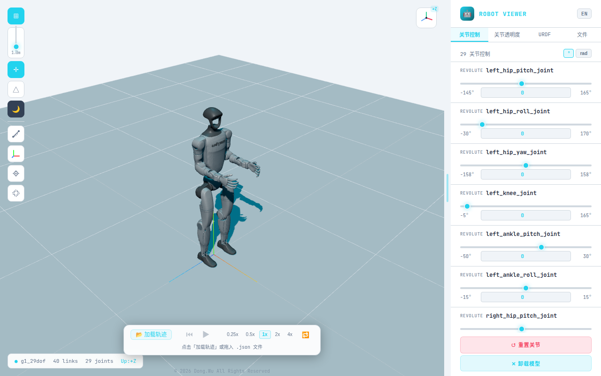
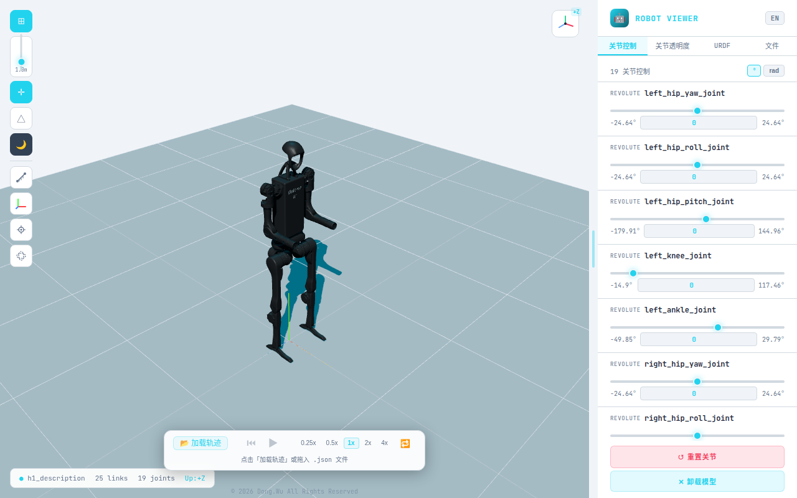
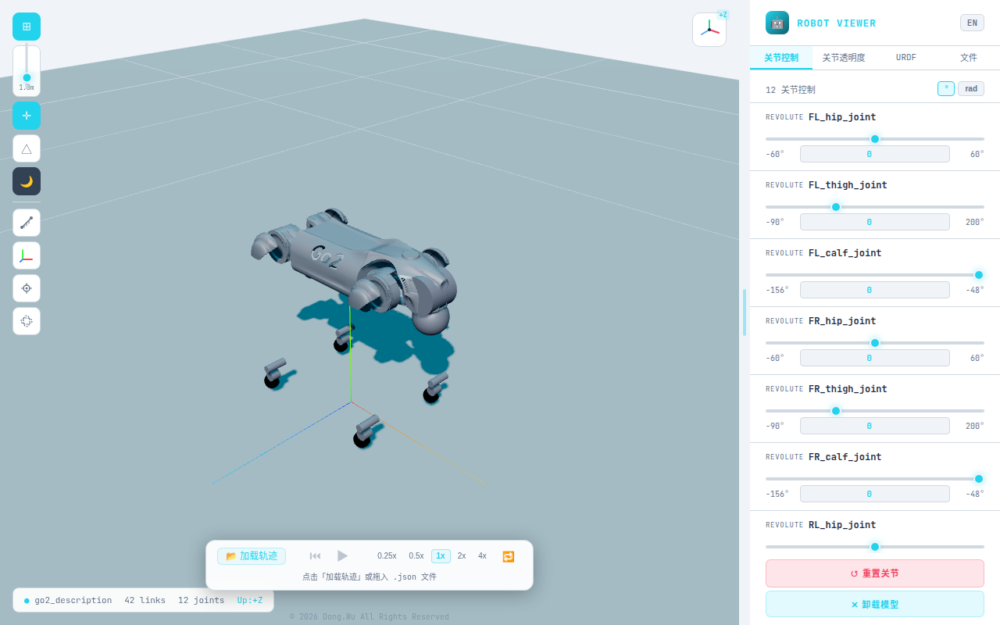
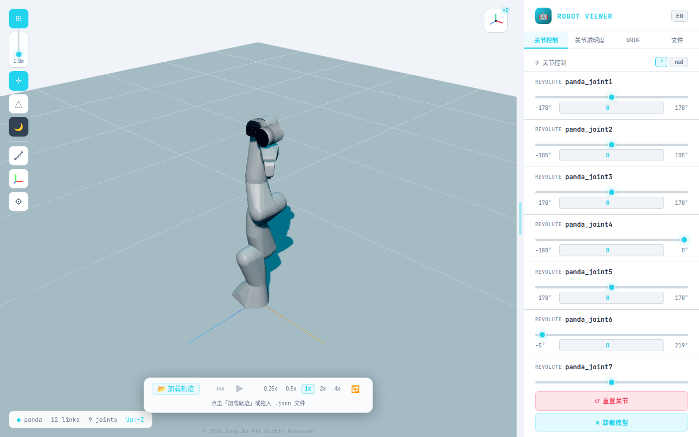

# 🤖 URDF Robot Viewer

基于 Three.js 的 Web 端 URDF 机器人模型查看器，支持拖放加载、关节控制、IK 拖动、测量工具等功能。

**在线体验：** [https://tony1213.github.io/urdf-viewer/](https://tony1213.github.io/urdf-viewer/)

## 截图

<table>
<tr>
<td align="center"><br><b>Unitree G1</b>（29-DOF 人形）</td>
<td align="center"><br><b>Unitree H1</b>（人形）</td>
</tr>
<tr>
<td align="center"><br><b>Unitree Go2</b>（四足）</td>
<td align="center"><br><b>Franka Panda</b>（7-DOF 协作臂）</td>
</tr>
</table>

## 功能特性

### 3D 视图
- PBR 材质渲染，阴影效果
- 左键旋转视角，中键平移，滚轮缩放（最近 5mm，乘法缩放）
- 亮色/暗色背景切换（默认亮色）
- 自定义主题色（8 种预设 + 自定义取色器）
- 坐标轴、网格（可调大小 0.1~5m）、线框模式
- Up Axis 切换（±X / ±Y / ±Z）
- 视角预设（前/后/左/右/上/透视）
- 模型高度偏移 + 自动落地

### 关节控制
- 侧边栏滑块实时控制 revolute / prismatic / continuous 关节
- 角度（°）/ 弧度（rad）切换，默认角度模式
- 数值输入框，支持直接输入目标角度（blur / Enter 提交，Esc 取消）
- 滑块和输入框双向联动
- 关节间距测量：点击两个关节名显示距离和 ΔX/ΔY/ΔZ 分量

### Link 交互
- 鼠标 hover link 高亮（青色 emissive）
- 左下角弹窗显示 link 属性（几何体、质量、惯量、关节信息、表面坐标）
- 按住左键拖动 link 可旋转其父关节
- 为每个 link 单独指定颜色（关节透明度 Tab 中的颜色选择器）
- 拖动时显示关节角度标注（橙色圆弧 + 箭头 + 角度/弧度值 + 零位标记）

### TCP IK 拖动（仅串联机械臂）
- 左侧工具栏 TCP 按钮（自动识别串联臂 vs 分支机器人）
- 激活后末端显示橙色可拖拽球
- CCD 逆运动学算法（20 次迭代）
- 拖动时关节值、滑块、输入框同步更新
- TCP 坐标实时显示（XYZ 位置 + RPY 姿态）

### 测量工具
- 左侧工具栏尺子按钮，点击进入测量模式
- 第一次点击设置起点（绿色标记球），第二次点击设置终点（红色标记球）
- 标记球自动吸附到最近的 mesh 顶点（精确到顶点级别）
- 标记球贴附在 link 表面，关节转动时跟随移动
- 两点间显示：橙色虚线 + 距离值（mm，精度 0.01mm）
- XYZ 分量：红/绿/蓝虚线 + 分量值
- 测量完成后可自由旋转视角查看结果
- 再次点击开始新测量，退出模式自动清除

### Mesh 格式支持
- STL（二进制 + ASCII）
- OBJ
- DAE（Collada），自动剥离 xmlns 命名空间，支持 node matrix 变换

### 侧边栏
| 标签 | 内容 |
|------|------|
| 关节控制 | 关节滑块 + °/rad 切换 + 数值输入框 + 关节间距 |
| 关节透明度 | 每个 link 独立透明度 + 自定义颜色 |
| URDF | 可折叠 URDF 树（link/joint 层级） |
| 文件 | 文件夹树结构浏览 |

### 其他
- 中英文切换（默认中文）
- 🤖 emoji favicon
- 关节坐标系 RGB 可视化（自动适配 link 大小，上下限 0.03~0.3m）
- 质心（COM）可视化
- 转动惯量椭球可视化
- © 2026 Dong.Wu All Rights Reserved

## 使用方法

### 在线使用

1. 打开 [https://tony1213.github.io/urdf-viewer/](https://tony1213.github.io/urdf-viewer/)
2. 将包含 URDF 文件和 mesh 文件的文件夹拖入页面
3. 或点击「选择文件夹」按钮选择本地文件夹

### 文件夹结构要求

```
your_robot/
├── urdf/robot.urdf      # 或根目录下的 .urdf 文件
└── meshes/
    ├── base_link.stl
    ├── link_1.stl
    └── ...
```

支持 `package://` 路径自动解析。

### 本地开发

```bash
git clone https://github.com/tony1213/urdf-viewer.git
cd urdf-viewer
npm install
npm run dev      # 开发模式
npm run build    # 构建生产版本
```

## 已测试机器人

| 机器人 | 类型 | Mesh 格式 | 状态 |
|--------|------|-----------|------|
| Franka Panda | 7-DOF 协作臂 | STL | ✅ 正常 |
| Fanuc M-10iA | 6-DOF 工业臂 | STL | ✅ 正常 |
| KUKA KR210 R2700-2 | 6-DOF 工业臂 | STL | ✅ 正常 |
| Unitree G1 | 29-DOF 人形 | STL | ✅ 正常 |
| Unitree H1 | 人形 | STL | ✅ 正常 |
| Unitree Go2 | 四足 | DAE | ⚠️ DAE 渲染问题 |
| PR2 | 移动操作平台 | STL/DAE | ✅ 正常 |

## 技术栈

- **前端框架：** React 18
- **3D 渲染：** Three.js 0.162.0
- **构建工具：** Vite
- **部署：** GitHub Pages（GitHub Actions 自动构建）

## 已知问题

- Go2 等使用 DAE 格式 mesh 的机器人可能存在 node matrix 变换问题
- Three.js 需固定在 0.162.0 版本（0.184.0 与 Vite 存在 TDZ 兼容性问题）

## License

MIT
